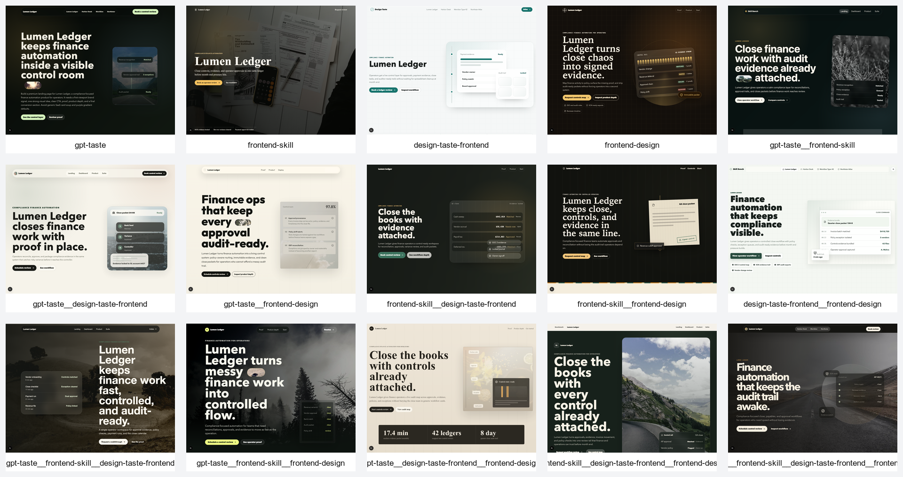
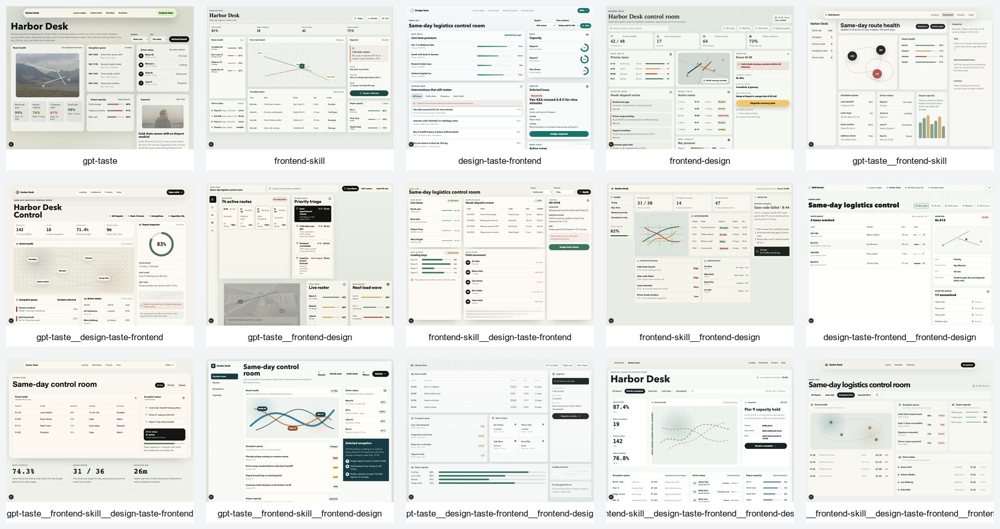

# Frontend Skills Benchmark

Which frontend skill setup actually makes better UI?

This benchmark gave the same app prompts to 15 skill profiles: every single skill, every pair, every triple, and the all-four combination. Each profile generated its own Next.js app. Then the outputs were built, screenshotted, and graded against the same rubric.

The winner was:

[`gpt-taste__frontend-skill__frontend-design`](bench/results/screenshots/gpt-taste__frontend-skill__frontend-design)

The interesting part is that the all-four setup did not win. More guidance helped up to a point, then it started to blur the design direction.

## Start Here

- [Full results write-up](RESULTS.md)
- [Source notes for writing about the benchmark](BENCHMARK_SOURCE_NOTES.md)
- [Screenshot gallery](bench/results/screenshots/README.md)
- [Contact-sheet comparisons](bench/results/contact-sheets)
- [Generated apps](bench/projects)
- [Rubric](bench/rubric.md)
- [Prompt set](bench/prompts/prompts.json)

## Results

| Rank | Profile | Score | Evidence | Source | Read |
| ---: | --- | ---: | --- | --- | --- |
| 1 | [`gpt-taste__frontend-skill__frontend-design`](bench/results/screenshots/gpt-taste__frontend-skill__frontend-design) | 91 | [screens](bench/results/screenshots/gpt-taste__frontend-skill__frontend-design) | [app](bench/projects/gpt-taste__frontend-skill__frontend-design) | Best overall. Bold, but still controlled. |
| 2 | [`frontend-skill__design-taste-frontend__frontend-design`](bench/results/screenshots/frontend-skill__design-taste-frontend__frontend-design) | 90 | [screens](bench/results/screenshots/frontend-skill__design-taste-frontend__frontend-design) | [app](bench/projects/frontend-skill__design-taste-frontend__frontend-design) | Best no-GPT-Taste setup. Strong for product suites and operational UI. |
| 3 | [`frontend-design`](bench/results/screenshots/frontend-design) | 89 | [screens](bench/results/screenshots/frontend-design) | [app](bench/projects/frontend-design) | Best single skill. Focused direction beat several combinations. |
| 4 | [`frontend-skill__frontend-design`](bench/results/screenshots/frontend-skill__frontend-design) | 89 | [screens](bench/results/screenshots/frontend-skill__frontend-design) | [app](bench/projects/frontend-skill__frontend-design) | Strong simple pair. Expressive without too many competing rules. |
| 5 | [`gpt-taste__frontend-skill__design-taste-frontend__frontend-design`](bench/results/screenshots/gpt-taste__frontend-skill__design-taste-frontend__frontend-design) | 89 | [screens](bench/results/screenshots/gpt-taste__frontend-skill__design-taste-frontend__frontend-design) | [app](bench/projects/gpt-taste__frontend-skill__design-taste-frontend__frontend-design) | All four skills. Good, but not the winner. |
| 6 | [`gpt-taste__frontend-skill`](bench/results/screenshots/gpt-taste__frontend-skill) | 88 | [screens](bench/results/screenshots/gpt-taste__frontend-skill) | [app](bench/projects/gpt-taste__frontend-skill) | GPT-Taste works much better when paired with restraint. |
| 7 | [`frontend-skill__design-taste-frontend`](bench/results/screenshots/frontend-skill__design-taste-frontend) | 88 | [screens](bench/results/screenshots/frontend-skill__design-taste-frontend) | [app](bench/projects/frontend-skill__design-taste-frontend) | Best practical pair for dashboards and utility screens. |
| 8 | [`gpt-taste__frontend-skill__design-taste-frontend`](bench/results/screenshots/gpt-taste__frontend-skill__design-taste-frontend) | 88 | [screens](bench/results/screenshots/gpt-taste__frontend-skill__design-taste-frontend) | [app](bench/projects/gpt-taste__frontend-skill__design-taste-frontend) | Solid product UI with a bolder first impression. |
| 9 | [`design-taste-frontend__frontend-design`](bench/results/screenshots/design-taste-frontend__frontend-design) | 87 | [screens](bench/results/screenshots/design-taste-frontend__frontend-design) | [app](bench/projects/design-taste-frontend__frontend-design) | Structured and distinctive, but not as complete as the top group. |
| 10 | [`gpt-taste__design-taste-frontend`](bench/results/screenshots/gpt-taste__design-taste-frontend) | 87 | [screens](bench/results/screenshots/gpt-taste__design-taste-frontend) | [app](bench/projects/gpt-taste__design-taste-frontend) | A bolder operational hybrid. |
| 11 | [`gpt-taste__frontend-design`](bench/results/screenshots/gpt-taste__frontend-design) | 86 | [screens](bench/results/screenshots/gpt-taste__frontend-design) | [app](bench/projects/gpt-taste__frontend-design) | Memorable, but less practical on dashboards. |
| 12 | [`design-taste-frontend`](bench/results/screenshots/design-taste-frontend) | 86 | [screens](bench/results/screenshots/design-taste-frontend) | [app](bench/projects/design-taste-frontend) | Best single skill for dashboard-style work. |
| 13 | [`gpt-taste__design-taste-frontend__frontend-design`](bench/results/screenshots/gpt-taste__design-taste-frontend__frontend-design) | 86 | [screens](bench/results/screenshots/gpt-taste__design-taste-frontend__frontend-design) | [app](bench/projects/gpt-taste__design-taste-frontend__frontend-design) | Interesting, but uneven. |
| 14 | [`frontend-skill`](bench/results/screenshots/frontend-skill) | 85 | [screens](bench/results/screenshots/frontend-skill) | [app](bench/projects/frontend-skill) | Clean and tasteful, but safer than the best combinations. |
| 15 | [`gpt-taste`](bench/results/screenshots/gpt-taste) | 84 | [screens](bench/results/screenshots/gpt-taste) | [app](bench/projects/gpt-taste) | Strong hero instincts, weaker utility and mobile resilience. |

## The One-Line Takeaway

The best result came from combining a bold visual skill, a practical frontend skill, and a strong concept/design skill. The all-four setup was good, but slightly less decisive.

## Evidence Snapshot

| Artifact | Count |
| --- | ---: |
| Skill profiles | 15 |
| Generated apps | 15 |
| Passing builds | 15 / 15 |
| Individual screenshots | 210 |
| Contact sheets | 14 |

## Preview

