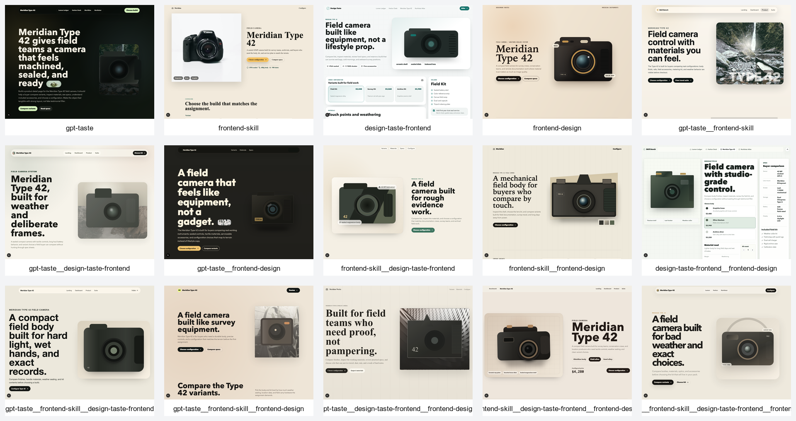
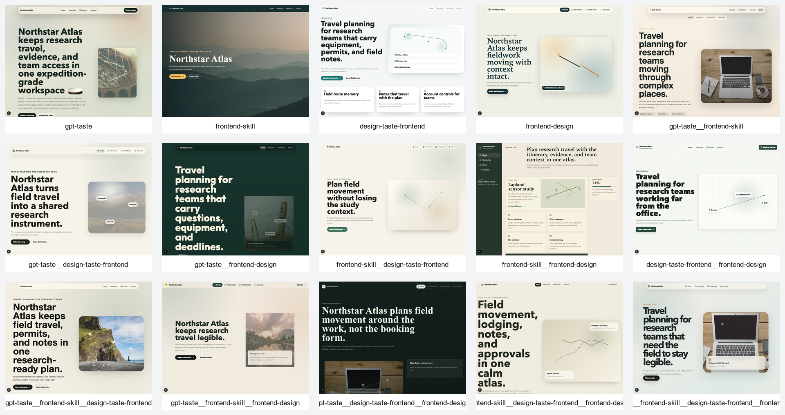

# Frontend Skills Benchmark Results

This is the fuller write-up for the benchmark. The README is intentionally shorter; this file carries the interpretation, caveats, and links into the evidence.

## What Happened

Four frontend skills were tested:

| Skill | Role in the benchmark |
| --- | --- |
| [`gpt-taste`](bench/skills/gpt-taste/SKILL.md) | Pushes harder on visual personality, motion, and dramatic composition. |
| [`frontend-skill`](bench/skills/frontend-skill/SKILL.md) | Adds restraint, practical layout judgment, and cleaner product structure. |
| [`design-taste-frontend`](bench/skills/design-taste-frontend/SKILL.md) | Helps with operational UI, dashboards, forms, and dense workflows. |
| [`frontend-design`](bench/skills/frontend-design/SKILL.md) | Improves concept direction, art direction, and complete page systems. |

The benchmark ran the full non-empty matrix: 4 singles, 6 pairs, 4 triples, and 1 all-four profile. Every profile received the same prompts and built the same route set.

## Main Finding

The best output came from `gpt-taste__frontend-skill__frontend-design`.

That result makes sense when you look at the screenshots. GPT-Taste brought energy. Frontend Skill kept it from turning into pure theater. Frontend Design made the pages feel more deliberate and less like styled placeholders.

The all-four setup was still strong, but it did not win. It had more instruction coverage, but the design point of view was a little less sharp. That is probably the most useful lesson here: stacking skills is not automatically additive. Sometimes the fourth voice helps. Sometimes it sandpapers the thing that made the design work.

## Best Picks

Use [`gpt-taste__frontend-skill__frontend-design`](bench/results/screenshots/gpt-taste__frontend-skill__frontend-design) for landing pages, product pages, and polished public product surfaces.

Use [`frontend-skill__design-taste-frontend`](bench/results/screenshots/frontend-skill__design-taste-frontend) for dashboards, settings screens, internal tools, and dense workflow UI.

Use [`frontend-skill__design-taste-frontend__frontend-design`](bench/results/screenshots/frontend-skill__design-taste-frontend__frontend-design) when you want the strongest setup without GPT-Taste.

Use [`frontend-design`](bench/results/screenshots/frontend-design) when you only want one skill.

Use [`gpt-taste`](bench/results/screenshots/gpt-taste) alone only when you specifically want a dramatic marketing surface and can accept weaker dashboard/mobile reliability.

## Full Ranking

| Rank | Profile | Score | Screenshots | Source | Short read |
| ---: | --- | ---: | --- | --- | --- |
| 1 | [`gpt-taste__frontend-skill__frontend-design`](bench/results/screenshots/gpt-taste__frontend-skill__frontend-design) | 91 | [open](bench/results/screenshots/gpt-taste__frontend-skill__frontend-design) | [app](bench/projects/gpt-taste__frontend-skill__frontend-design) | Best overall. Dramatic, restrained, and more conceptually complete than the rest. |
| 2 | [`frontend-skill__design-taste-frontend__frontend-design`](bench/results/screenshots/frontend-skill__design-taste-frontend__frontend-design) | 90 | [open](bench/results/screenshots/frontend-skill__design-taste-frontend__frontend-design) | [app](bench/projects/frontend-skill__design-taste-frontend__frontend-design) | Best no-GPT-Taste option. Strong dashboard discipline and cohesive suite pages. |
| 3 | [`frontend-design`](bench/results/screenshots/frontend-design) | 89 | [open](bench/results/screenshots/frontend-design) | [app](bench/projects/frontend-design) | Strongest single skill. It beat several multi-skill combinations. |
| 4 | [`frontend-skill__frontend-design`](bench/results/screenshots/frontend-skill__frontend-design) | 89 | [open](bench/results/screenshots/frontend-skill__frontend-design) | [app](bench/projects/frontend-skill__frontend-design) | A clean two-skill setup with fewer conflicting constraints. |
| 5 | [`gpt-taste__frontend-skill__design-taste-frontend__frontend-design`](bench/results/screenshots/gpt-taste__frontend-skill__design-taste-frontend__frontend-design) | 89 | [open](bench/results/screenshots/gpt-taste__frontend-skill__design-taste-frontend__frontend-design) | [app](bench/projects/gpt-taste__frontend-skill__design-taste-frontend__frontend-design) | The all-four profile. Broad and competent, but not the sharpest. |
| 6 | [`gpt-taste__frontend-skill`](bench/results/screenshots/gpt-taste__frontend-skill) | 88 | [open](bench/results/screenshots/gpt-taste__frontend-skill) | [app](bench/projects/gpt-taste__frontend-skill) | A strong marketing/product pair. Much better controlled than GPT-Taste alone. |
| 7 | [`frontend-skill__design-taste-frontend`](bench/results/screenshots/frontend-skill__design-taste-frontend) | 88 | [open](bench/results/screenshots/frontend-skill__design-taste-frontend) | [app](bench/projects/frontend-skill__design-taste-frontend) | The most practical dashboard pair. |
| 8 | [`gpt-taste__frontend-skill__design-taste-frontend`](bench/results/screenshots/gpt-taste__frontend-skill__design-taste-frontend) | 88 | [open](bench/results/screenshots/gpt-taste__frontend-skill__design-taste-frontend) | [app](bench/projects/gpt-taste__frontend-skill__design-taste-frontend) | Dense product UI with a bolder first impression. |
| 9 | [`design-taste-frontend__frontend-design`](bench/results/screenshots/design-taste-frontend__frontend-design) | 87 | [open](bench/results/screenshots/design-taste-frontend__frontend-design) | [app](bench/projects/design-taste-frontend__frontend-design) | Good structure and character, but not quite top-tier. |
| 10 | [`gpt-taste__design-taste-frontend`](bench/results/screenshots/gpt-taste__design-taste-frontend) | 87 | [open](bench/results/screenshots/gpt-taste__design-taste-frontend) | [app](bench/projects/gpt-taste__design-taste-frontend) | Better utility discipline than GPT-Taste alone. |
| 11 | [`gpt-taste__frontend-design`](bench/results/screenshots/gpt-taste__frontend-design) | 86 | [open](bench/results/screenshots/gpt-taste__frontend-design) | [app](bench/projects/gpt-taste__frontend-design) | Strong first impressions, weaker dashboard ergonomics. |
| 12 | [`design-taste-frontend`](bench/results/screenshots/design-taste-frontend) | 86 | [open](bench/results/screenshots/design-taste-frontend) | [app](bench/projects/design-taste-frontend) | Best single skill for dashboards, weaker on marketing memorability. |
| 13 | [`gpt-taste__design-taste-frontend__frontend-design`](bench/results/screenshots/gpt-taste__design-taste-frontend__frontend-design) | 86 | [open](bench/results/screenshots/gpt-taste__design-taste-frontend__frontend-design) | [app](bench/projects/gpt-taste__design-taste-frontend__frontend-design) | More editorial than useful in places. |
| 14 | [`frontend-skill`](bench/results/screenshots/frontend-skill) | 85 | [open](bench/results/screenshots/frontend-skill) | [app](bench/projects/frontend-skill) | Reliable and polished, but safe. |
| 15 | [`gpt-taste`](bench/results/screenshots/gpt-taste) | 84 | [open](bench/results/screenshots/gpt-taste) | [app](bench/projects/gpt-taste) | Memorable, but too forceful and less resilient on utility pages. |

## Page-Type Results

| Page type | Winner | Score | Evidence |
| --- | --- | ---: | --- |
| Landing page | `gpt-taste__frontend-skill__frontend-design` | 92 | [desktop](bench/results/screenshots/gpt-taste__frontend-skill__frontend-design/landing-desktop.png), [mobile](bench/results/screenshots/gpt-taste__frontend-skill__frontend-design/landing-mobile.png), [contact sheet](bench/results/contact-sheets/landing-desktop.png) |
| Operations dashboard | `gpt-taste__frontend-skill__frontend-design` | 91 | [desktop](bench/results/screenshots/gpt-taste__frontend-skill__frontend-design/dashboard-desktop.png), [mobile](bench/results/screenshots/gpt-taste__frontend-skill__frontend-design/dashboard-mobile.png), [contact sheet](bench/results/contact-sheets/dashboard-desktop.png) |
| Product detail page | `gpt-taste__frontend-skill__frontend-design` | 91 | [desktop](bench/results/screenshots/gpt-taste__frontend-skill__frontend-design/product-desktop.png), [mobile](bench/results/screenshots/gpt-taste__frontend-skill__frontend-design/product-mobile.png), [contact sheet](bench/results/contact-sheets/product-desktop.png) |
| Four-page mini site | `gpt-taste__frontend-skill__frontend-design` | 90 | [desktop](bench/results/screenshots/gpt-taste__frontend-skill__frontend-design/four-page-desktop.png), [mobile](bench/results/screenshots/gpt-taste__frontend-skill__frontend-design/four-page-mobile.png), [contact sheet](bench/results/contact-sheets/four-page-desktop.png) |

The dashboard result is close. `frontend-skill__design-taste-frontend` also scored 91 there, and I would still reach for that pair first if the job is a real operational product rather than a public-facing benchmark spread.

## What The Scores Mean

The scores are qualitative. They are not pretending to be lab-grade science.

They do mean something, though. Every profile got the same prompts, the same required pages, the same build gate, the same screenshot process, and the same rubric. The results are not just vibes written after looking at one hero section.

The useful read is:

- Combinations generally beat single skills.
- The best single skill still beat several combinations.
- GPT-Taste improved a lot when paired with practical constraints.
- The all-four setup was strong, but the best triple had a clearer point of view.
- Dashboard-heavy work wants different guidance than landing-page work.

## Evidence

| File or folder | What it is |
| --- | --- |
| [bench/results/screenshots/README.md](bench/results/screenshots/README.md) | Index of separate desktop and mobile screenshots. |
| [bench/results/screenshots](bench/results/screenshots) | All individual screenshot files. |
| [bench/results/contact-sheets](bench/results/contact-sheets) | Big comparison images across all profiles. |
| [bench/results/grades.json](bench/results/grades.json) | Machine-readable grading data. |
| [bench/results/build-results.json](bench/results/build-results.json) | Build results for all generated apps. |
| [bench/results/screenshot-results.json](bench/results/screenshot-results.json) | Screenshot capture manifest. |
| [bench/results/report.md](bench/results/report.md) | Original benchmark report. |
| [bench/results/final-evaluation.md](bench/results/final-evaluation.md) | Validity and bias check. |
| [bench/projects](bench/projects) | Generated Next.js apps. |
| [bench/prompts/prompts.json](bench/prompts/prompts.json) | Shared prompt set. |
| [bench/rubric.md](bench/rubric.md) | Scoring rubric. |

Validation summary:

| Check | Result |
| --- | ---: |
| Generated apps | 15 |
| Builds passed | 15 / 15 |
| Individual screenshots | 210 |
| Contact sheets | 14 |
| Public worker logs | 0 |

Raw worker logs are intentionally not included. They are useful while running the benchmark, but not something that belongs in a public repo.

## Contact-Sheet Preview

### Landing Page

### Operations Dashboard

### Product Detail Page

### Four-Page Mini Site

## Limits

Do not read this as proof that one skill is universally best.

This is one controlled benchmark run. There was one generation per profile, grading was qualitative, and the outputs came from one GPT-5.5 Codex-worker setup. The skill snapshots may also drift from whatever is currently upstream.

The fair claim is narrower: in this run, with these prompts and this rubric, the strongest overall result was `gpt-taste__frontend-skill__frontend-design`.

## Skill Sources

- [GPT-Taste](https://www.skills.sh/leonxlnx/taste-skill/gpt-taste)
- [OpenAI Frontend Skill](https://www.skills.sh/openai/skills/frontend-skill)
- [Design Taste Frontend](https://www.skills.sh/leonxlnx/taste-skill/design-taste-frontend)
- [Anthropic Frontend Design](https://www.skills.sh/anthropics/skills/frontend-design)
