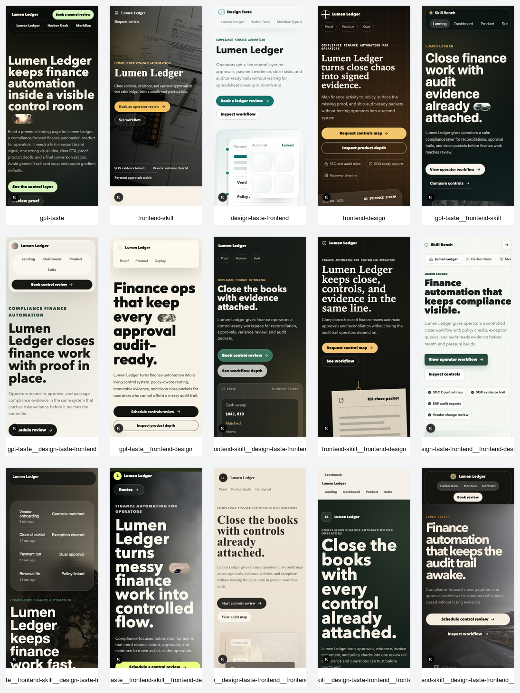
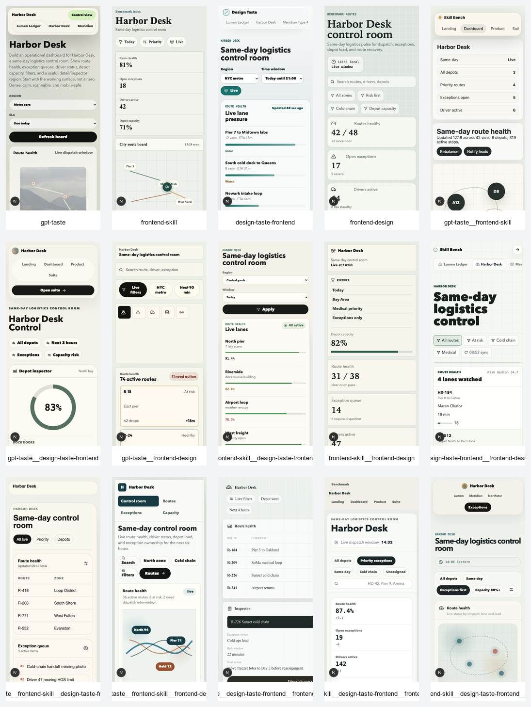
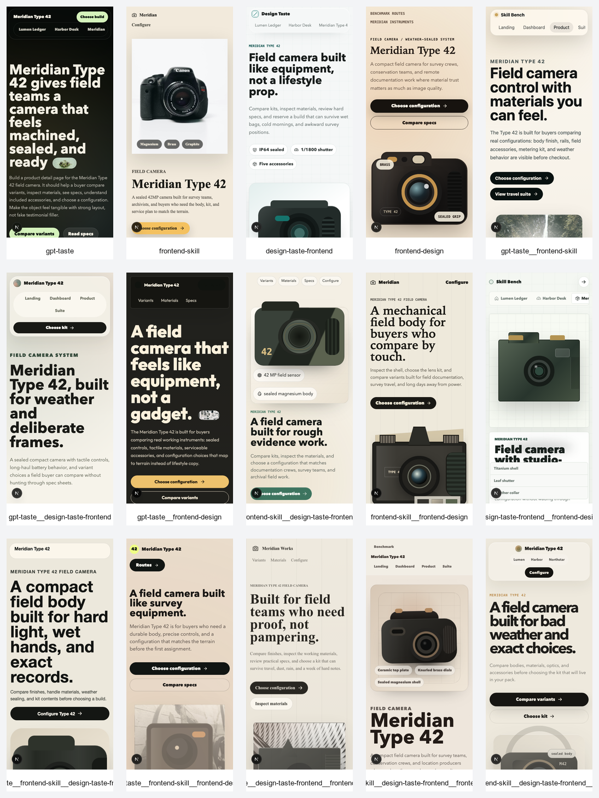
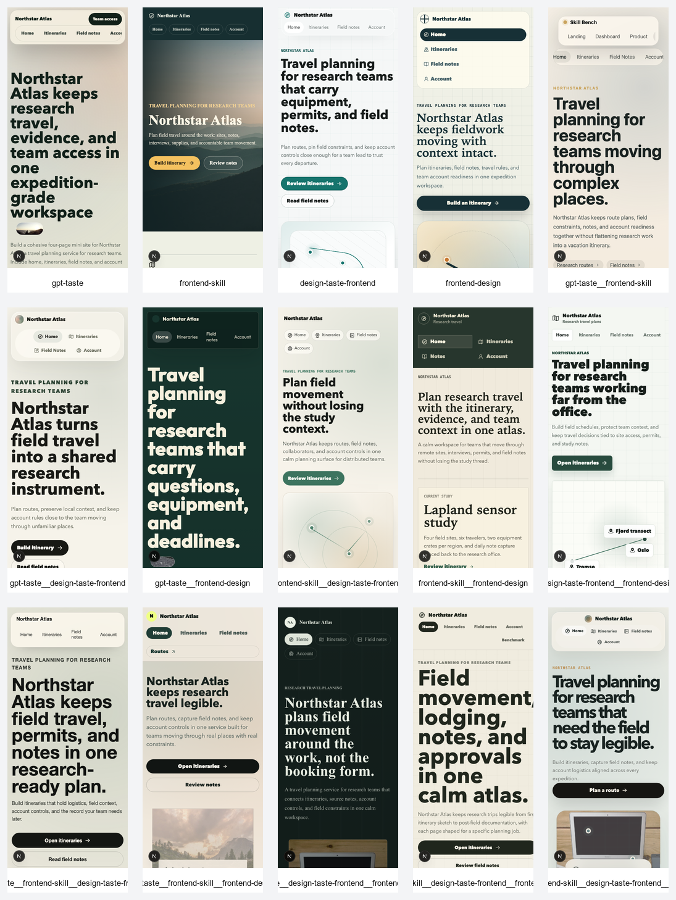
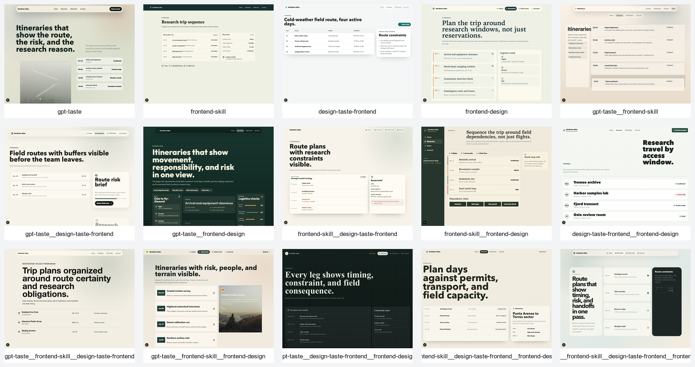
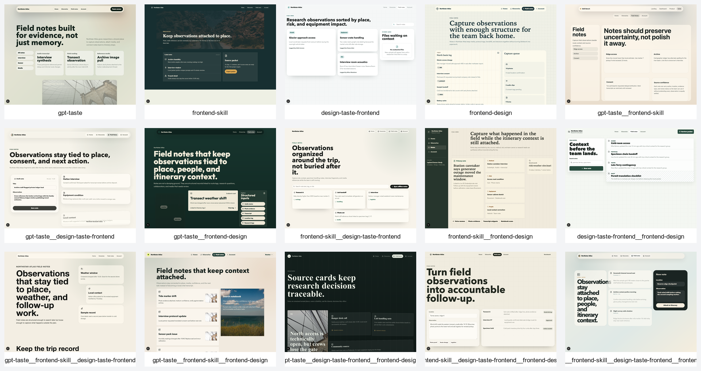
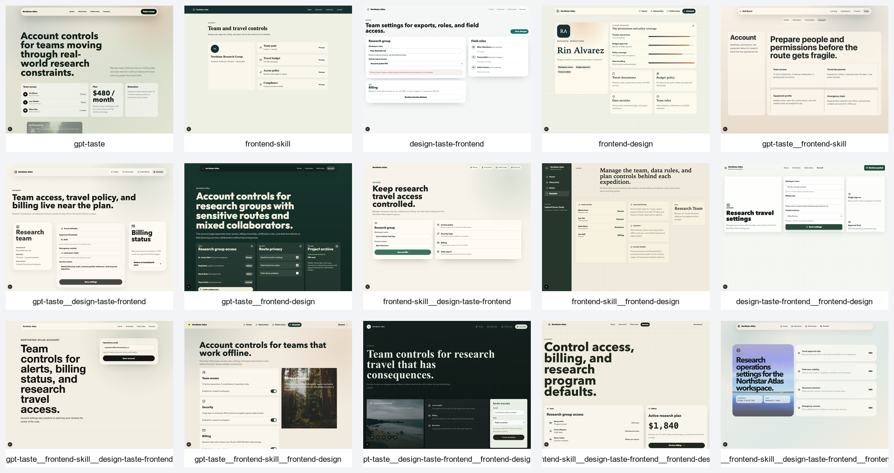

# Frontend Skill Benchmark Report

## Executive Summary

This benchmark now covers the full non-empty combination matrix for the four skill snapshots: 4 singles, 6 pairs, 4 triples, and the all-four profile. Every profile received the same four prompts and built a separate Next.js app under `bench/projects/`.

The corrected result: combinations usually help, but all four together is not automatically best. The strongest run was `gpt-taste__frontend-skill__frontend-design`, because it kept GPT-Taste's visual force, frontend-skill's restraint, and frontend-design's stronger concept work without adding the extra operational constraints that sometimes flatten the output. The best no-GPT-Taste option was `frontend-skill__design-taste-frontend__frontend-design`.

## Ranking

| Rank | Profile | Score | Best Fit |
| ---: | --- | ---: | --- |
| 1 | `gpt-taste__frontend-skill__frontend-design` | 91 | High-impact marketing and product pages that still need restraint |
| 2 | `frontend-skill__design-taste-frontend__frontend-design` | 90 | Balanced product suites and operational UI with strong visual identity |
| 3 | `frontend-design` | 89 | Distinctive page concepts and cohesive visual systems |
| 4 | `frontend-skill__frontend-design` | 89 | Expressive pages with fewer conflicting implementation constraints |
| 5 | `gpt-taste__frontend-skill__design-taste-frontend__frontend-design` | 89 | Broad all-purpose coverage |
| 6 | `gpt-taste__frontend-skill` | 88 | Bold marketing pages tempered by restraint |
| 7 | `frontend-skill__design-taste-frontend` | 88 | Dashboards and practical multi-page product UI |
| 8 | `gpt-taste__frontend-skill__design-taste-frontend` | 88 | Dense product flows with a bolder first impression |
| 9 | `design-taste-frontend__frontend-design` | 87 | Operational pages with a distinctive wrapper |
| 10 | `gpt-taste__design-taste-frontend` | 87 | Bolder operational/marketing hybrids |
| 11 | `gpt-taste__frontend-design` | 86 | Dark, expressive, memorable pages |
| 12 | `design-taste-frontend` | 86 | Dashboards and operational tools |
| 13 | `gpt-taste__design-taste-frontend__frontend-design` | 86 | Editorial, concept-heavy surfaces |
| 14 | `frontend-skill` | 85 | Tasteful restrained pages |
| 15 | `gpt-taste` | 84 | High-impact hero pages |

## Profile Guide

Profile IDs are the included skill IDs joined by `__`. For example, `frontend-skill__design-taste-frontend` means the profile used OpenAI Frontend Skill and Design Taste Frontend together.

| Rank | Profile | Type | Includes | Score | Best Use |
| ---: | --- | --- | --- | ---: | --- |
| 1 | `gpt-taste__frontend-skill__frontend-design` | Triple | GPT-Taste, OpenAI Frontend Skill, Anthropic Frontend Design | 91 | High-impact marketing and product pages that still need restraint |
| 2 | `frontend-skill__design-taste-frontend__frontend-design` | Triple | OpenAI Frontend Skill, Design Taste Frontend, Anthropic Frontend Design | 90 | Balanced product suites and operational UI with strong visual identity |
| 3 | `frontend-design` | Single | Anthropic Frontend Design | 89 | Distinctive page concepts and cohesive visual systems |
| 4 | `frontend-skill__frontend-design` | Pair | OpenAI Frontend Skill, Anthropic Frontend Design | 89 | Expressive pages that need fewer conflicting implementation constraints |
| 5 | `gpt-taste__frontend-skill__design-taste-frontend__frontend-design` | All four | GPT-Taste, OpenAI Frontend Skill, Design Taste Frontend, Anthropic Frontend Design | 89 | Broad all-purpose coverage when consistency matters more than a single sharp direction |
| 6 | `gpt-taste__frontend-skill` | Pair | GPT-Taste, OpenAI Frontend Skill | 88 | Balanced marketing pages where expressive composition needs restraint |
| 7 | `frontend-skill__design-taste-frontend` | Pair | OpenAI Frontend Skill, Design Taste Frontend | 88 | Dashboards and practical multi-page product UI |
| 8 | `gpt-taste__frontend-skill__design-taste-frontend` | Triple | GPT-Taste, OpenAI Frontend Skill, Design Taste Frontend | 88 | Dense product flows that still need a bolder first impression |
| 9 | `design-taste-frontend__frontend-design` | Pair | Design Taste Frontend, Anthropic Frontend Design | 87 | Operational pages with a more distinctive visual wrapper |
| 10 | `gpt-taste__design-taste-frontend` | Pair | GPT-Taste, Design Taste Frontend | 87 | Bolder operational/marketing hybrids |
| 11 | `gpt-taste__frontend-design` | Pair | GPT-Taste, Anthropic Frontend Design | 86 | Dark, expressive, memorable pages |
| 12 | `design-taste-frontend` | Single | Design Taste Frontend | 86 | Dashboards and operational tools |
| 13 | `gpt-taste__design-taste-frontend__frontend-design` | Triple | GPT-Taste, Design Taste Frontend, Anthropic Frontend Design | 86 | Editorial, concept-heavy surfaces |
| 14 | `frontend-skill` | Single | OpenAI Frontend Skill | 85 | Tasteful restrained pages |
| 15 | `gpt-taste` | Single | GPT-Taste | 84 | High-impact hero pages |

## Combination Takeaways

The best triple beat the all-four profile. `gpt-taste__frontend-skill__frontend-design` had enough visual aggression to avoid safe UI, enough restraint to keep the pages usable, and enough conceptual range to avoid repeated hero patterns.

All four skills together were good, but not best. The all-four run scored 89 because it had broad competence and strong routes, but the visual direction felt more blended. More instructions improved coverage, not taste.

`frontend-skill__design-taste-frontend` is the most practical pair for operational UI. It does not win the overall visual benchmark, but its dashboard and admin-style pages are stronger than most louder combinations.

`frontend-design` remains the strongest single skill. It beat every single-skill competitor and also beat several combinations, which is useful evidence that a focused strong skill can outperform noisy pairings.

`gpt-taste` improves when paired. Alone it was memorable but too forceful; its best result came when paired with both frontend-skill and frontend-design.

## Rankings By Page Type

These rankings answer the practical question: if you are building this kind of page, which profile should you reach for?

### Landing Page

| Rank | Profile | Score |
| ---: | --- | ---: |
| 1 | `gpt-taste__frontend-skill__frontend-design` | 92 |
| 2 | `frontend-design` | 90 |
| 3 | `frontend-skill__frontend-design` | 90 |
| 4 | `gpt-taste__frontend-skill__design-taste-frontend__frontend-design` | 90 |
| 5 | `frontend-skill__design-taste-frontend__frontend-design` | 89 |
| 6 | `gpt-taste__frontend-skill` | 88 |
| 7 | `gpt-taste__frontend-skill__design-taste-frontend` | 88 |
| 8 | `design-taste-frontend__frontend-design` | 88 |
| 9 | `gpt-taste__design-taste-frontend` | 88 |
| 10 | `gpt-taste__frontend-design` | 88 |
| 11 | `gpt-taste__design-taste-frontend__frontend-design` | 87 |
| 12 | `frontend-skill` | 87 |
| 13 | `frontend-skill__design-taste-frontend` | 85 |
| 14 | `gpt-taste` | 85 |
| 15 | `design-taste-frontend` | 82 |

### Operations Dashboard

| Rank | Profile | Score |
| ---: | --- | ---: |
| 1 | `gpt-taste__frontend-skill__frontend-design` | 91 |
| 2 | `frontend-skill__design-taste-frontend__frontend-design` | 91 |
| 3 | `frontend-skill__design-taste-frontend` | 91 |
| 4 | `gpt-taste__frontend-skill__design-taste-frontend__frontend-design` | 90 |
| 5 | `design-taste-frontend` | 90 |
| 6 | `gpt-taste__frontend-skill__design-taste-frontend` | 89 |
| 7 | `frontend-design` | 88 |
| 8 | `frontend-skill__frontend-design` | 88 |
| 9 | `gpt-taste__frontend-skill` | 88 |
| 10 | `gpt-taste__design-taste-frontend` | 88 |
| 11 | `gpt-taste__design-taste-frontend__frontend-design` | 85 |
| 12 | `design-taste-frontend__frontend-design` | 84 |
| 13 | `gpt-taste__frontend-design` | 84 |
| 14 | `frontend-skill` | 84 |
| 15 | `gpt-taste` | 83 |

### Product Detail Page

| Rank | Profile | Score |
| ---: | --- | ---: |
| 1 | `gpt-taste__frontend-skill__frontend-design` | 91 |
| 2 | `frontend-skill__design-taste-frontend__frontend-design` | 90 |
| 3 | `frontend-design` | 90 |
| 4 | `frontend-skill__frontend-design` | 90 |
| 5 | `gpt-taste__frontend-skill__design-taste-frontend__frontend-design` | 89 |
| 6 | `gpt-taste__frontend-design` | 89 |
| 7 | `gpt-taste__frontend-skill` | 88 |
| 8 | `frontend-skill__design-taste-frontend` | 88 |
| 9 | `gpt-taste__frontend-skill__design-taste-frontend` | 88 |
| 10 | `design-taste-frontend__frontend-design` | 88 |
| 11 | `gpt-taste__design-taste-frontend` | 88 |
| 12 | `frontend-skill` | 88 |
| 13 | `gpt-taste__design-taste-frontend__frontend-design` | 86 |
| 14 | `design-taste-frontend` | 85 |
| 15 | `gpt-taste` | 80 |

### Four-Page Mini Site

| Rank | Profile | Score |
| ---: | --- | ---: |
| 1 | `gpt-taste__frontend-skill__frontend-design` | 90 |
| 2 | `frontend-skill__design-taste-frontend__frontend-design` | 90 |
| 3 | `frontend-design` | 88 |
| 4 | `frontend-skill__frontend-design` | 88 |
| 5 | `gpt-taste__frontend-skill__design-taste-frontend__frontend-design` | 88 |
| 6 | `frontend-skill__design-taste-frontend` | 88 |
| 7 | `design-taste-frontend__frontend-design` | 88 |
| 8 | `gpt-taste__frontend-skill` | 87 |
| 9 | `gpt-taste__frontend-skill__design-taste-frontend` | 87 |
| 10 | `design-taste-frontend` | 87 |
| 11 | `gpt-taste__design-taste-frontend` | 86 |
| 12 | `gpt-taste__design-taste-frontend__frontend-design` | 86 |
| 13 | `frontend-skill` | 85 |
| 14 | `gpt-taste__frontend-design` | 84 |
| 15 | `gpt-taste` | 82 |

## Rubric Category Leaders

These are narrower rubric-category rankings. They are useful when you care about a specific quality more than the final composite score.

| Category | Winner | Score | Useful Read |
| --- | --- | ---: | --- |
| Product fit and task completion | `gpt-taste__frontend-skill__frontend-design` | 19 | Best prompt coverage without losing page intent |
| Visual hierarchy and composition | `gpt-taste__frontend-skill__frontend-design` | 18 | Tied cluster, with global rank as tie-break |
| Distinctiveness without gimmickry | `gpt-taste__frontend-skill__frontend-design` | 14 | Tied cluster, strongest overall execution |
| Information architecture and workflow clarity | `gpt-taste__frontend-skill__frontend-design` | 15 | Tied with several operationally strong profiles |
| Responsive resilience and text handling | `gpt-taste__frontend-skill__frontend-design` | 9 | Tied cluster; top profile avoided the worst mobile failures |
| Interaction states and motion appropriateness | `gpt-taste__frontend-design` | 9 | GPT-Taste combinations led motion/personality |
| Technical execution and maintainability | `gpt-taste__frontend-skill__frontend-design` | 9 | Broad tie, all top profiles built cleanly |

## Validity And Bias Audit

This benchmark is valid as an artifact-backed qualitative comparison of these local skill snapshots in this generation environment. It should not be described as a statistically unbiased or universal ranking.

Credibility controls:

- Every profile received the same prompt file.
- Every profile built the same route set.
- The benchmark used the full non-empty combination matrix, not a cherry-picked subset.
- Scores use the same rubric and are backed by screenshots, contact sheets, build output, generated source, prompts, rubric, and scoring files.
- The compared skill snapshots are committed locally, so the input instructions are inspectable.
- No image generation was allowed for the generated apps.

Limitations:

- Scores are qualitative and reflect the rubric's taste priorities.
- The grading was not blind.
- There was one generation per profile, so there are no repeated trials or confidence intervals.
- The same GPT-5.5 Codex-worker model/session and reasoning setup generated the apps, so this measures these skill prompts in this environment rather than every possible agent setup.
- The local skill snapshots may drift from current upstream versions.
- Page and category ranking ties are resolved by global rank. Treat tied winners as tied clusters, not decisive category-only victories.

## Evidence

- Build results: `bench/results/build-results.json`
- Screenshot manifest: `bench/results/screenshot-results.json`
- Screenshot index: `bench/results/screenshots/README.md`
- Full screenshots: `bench/results/screenshots/`
- Contact sheets: `bench/results/contact-sheets/`
- Machine-readable grades: `bench/results/grades.json`
- Readable JSON report: `bench/results/report.json`
- Final evaluation: `bench/results/final-evaluation.md`

All 15 apps passed `bunx next build`. Screenshot capture produced 210 screenshots: 15 profiles, 7 routes, and 2 viewports.

Raw worker logs are intentionally excluded from the public repository because they can contain local paths and machine-specific diagnostic output.

## Screenshot Evidence

Use the contact sheets for the big comparison view and `bench/results/screenshots/README.md` for separate desktop/mobile links for every profile and page.

## Contact Sheet Preview

The contact sheets are ordered by `bench/profiles.json`.

### Landing Page

### Operations Dashboard

### Product Detail Page

### Four-Page Mini Site

Nested route checks:

- 
- 
- 

## Notes On Fairness

- The same prompt file was used for every profile: `bench/prompts/prompts.json`.
- The Anthropic skill was captured in `bench/skills/frontend-design/SKILL.md` as a local benchmark snapshot only; it was not installed globally.
- No AI image generation tools were used. A code search over generated project source found no image-generation calls.
- Scores are qualitative but tied to the shared rubric, build output, and rendered screenshots. This is not a claim of zero bias.

## Sources

- GPT-Taste: https://www.skills.sh/leonxlnx/taste-skill/gpt-taste
- OpenAI Frontend Skill: https://www.skills.sh/openai/skills/frontend-skill
- Design Taste Frontend: https://www.skills.sh/leonxlnx/taste-skill/design-taste-frontend
- Anthropic Frontend Design: https://www.skills.sh/anthropics/skills/frontend-design
